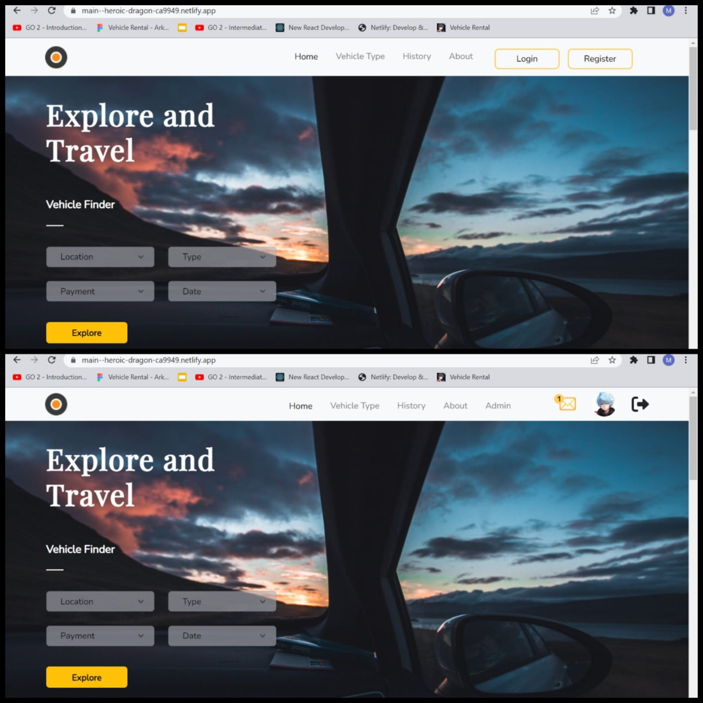
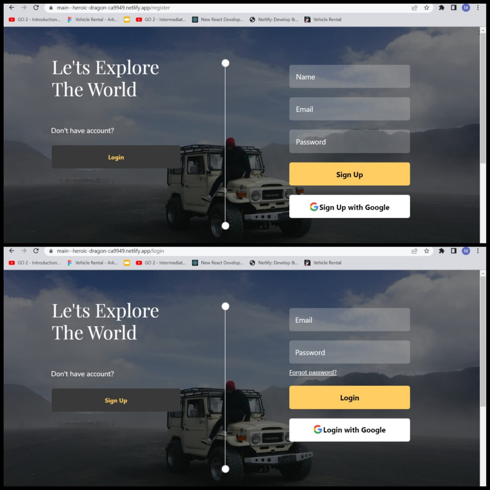
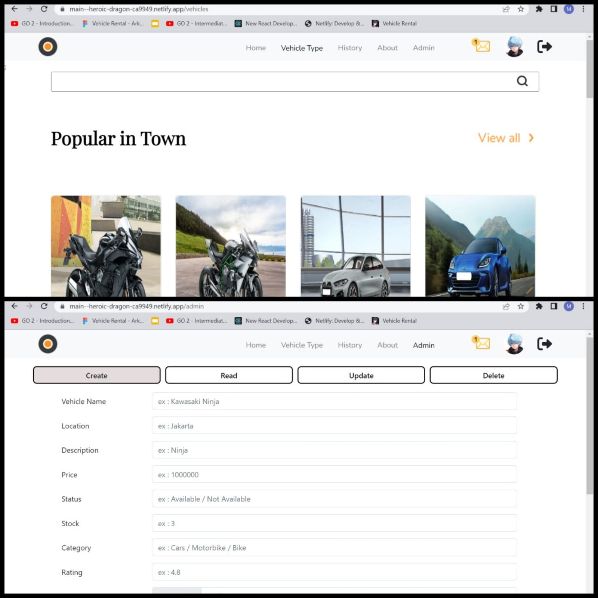

# Backend Golang 2 Week 12

Front End - Vehicle Rental with React

## Screenshots

### 1.Before-After Login



### 2.Form Register and Login



### 3.Page Vehicle Type and Admin Only



## Clone

```bash
git clone https://github.com/wildanfaz/fe_vehiclerental.git
```

## Dependencies

```bash
go mod tidy
```

## Netlify

```bash
https://main--heroic-dragon-ca9949.netlify.app/
```

## Heroku

```bash
https://fazdev-go-vehiclerental.herokuapp.com/api/v1/
```

## Postman

```bash
https://documenter.getpostman.com/view/22978251/2s847Fut5c
```

## Features

- Register
- Login
- React
- Redux
- Redux Persist
- Redux Toolkit
- Private Route
- CRUD
- Page for Admin Only
- Search Query
- URL Params
- Sort Dropdown
- Auth (JWT)
- Axios
- Search
- Netlify
- Heroku
- Postman

## Tech Stack

**Client:** Javascript, React, Redux, React-Bootstrap

**Server:** Golang, PostgreSQL, GORM, Gorilla/mux

## Author

- [@wildanfaz](https://www.github.com/wildanfaz)
